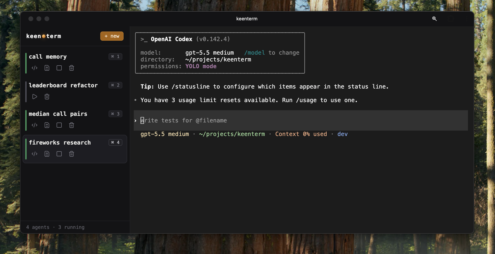

# keenterm

A terminal where every tab is its own Linux.

keenterm is a local control plane for running multiple coding agents in parallel, each inside its own full Linux VM on macOS (via [OrbStack](https://orbstack.dev/)). Every agent gets its own filesystem, its own Postgres, Redis, Hasura, Temporal — its own copy of the repo. Agents can't step on each other because they live in different machines.



## Why VMs instead of worktrees or Docker

- **Worktrees** isolate code, but a project is more than code: it's your database with years of local data, a warm cache, background workers. Worktrees share all of that.
- **Docker** is used *inside* each VM — the whole dev stack is baked into the image. But containers on the host don't give memory back once they grab it. OrbStack does, which is why the whole thing sits on it.
- **Copy-on-write cloning** makes worlds cheap: a ~10GB base image (Docker images, Postgres data, the repo) is shared by every clone, which only pays for what it changes. Ten VMs with full dev environments run in ~9–10GB of RAM on a laptop.

Opening a new tab takes about three seconds. That's the cost of booting a world.

## What it does

- Spawn, start, stop, and delete agent VMs from the web UI (`⌘1`–`⌘4` to switch between them)
- Server-owned Codex PTY sessions with buffered replay after websocket reconnect
- Built-in diff viewer (on top of Pierre's React diff primitives) to review agent changes without opening an editor
- One-click VS Code SSH into any VM
- Stack repair: bring up the docker compose services inside a VM with one call
- Sidequests: agents can spawn their own agents

Read more in the blog post: [A terminal where every tab is its own Linux](https://dimailin.com/keenterm/).

## Architecture

```text
web UI
  -> REST /api/agents
  -> websocket /term?machine=shilo-agent-N

server (Effect TS, :7070)
  Agents      lifecycle + diff
  Machines    orbctl/orb wrapper
  VmStack     VM-local docker compose status/up
  Codex       persistent PTY sessions
```

State is derived live from `orbctl`, docker-in-VM, and PTY sessions. There is no database.

## Tree

```text
server/          Effect TS backend
web/             React operator UI
scripts/         keenterm CLI/MCP helpers
docs/            current state, decisions, product direction, research notes
experiments/     isolated spikes and prototypes
```

## Run

```sh
pnpm install
pnpm dev        # starts server (:7070) and web UI
```

Requires macOS with [OrbStack](https://orbstack.dev/) and a base VM image to clone agents from. See `docs/current-state.md` for details.

> This is a personal daily tool, not a product. It's shared as-is.
